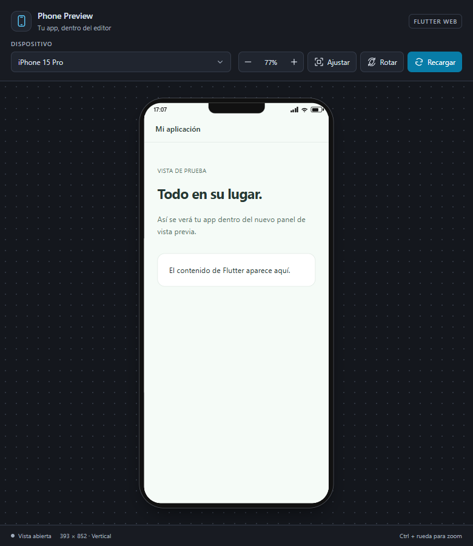
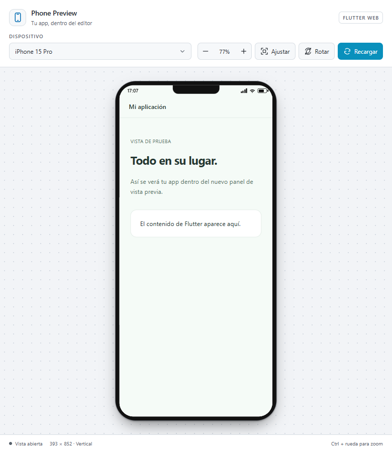
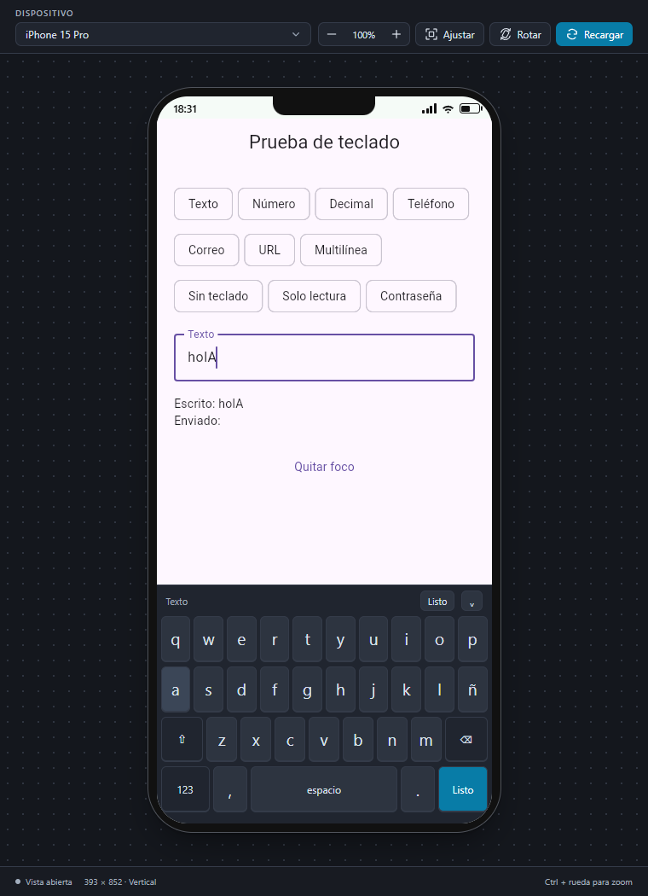
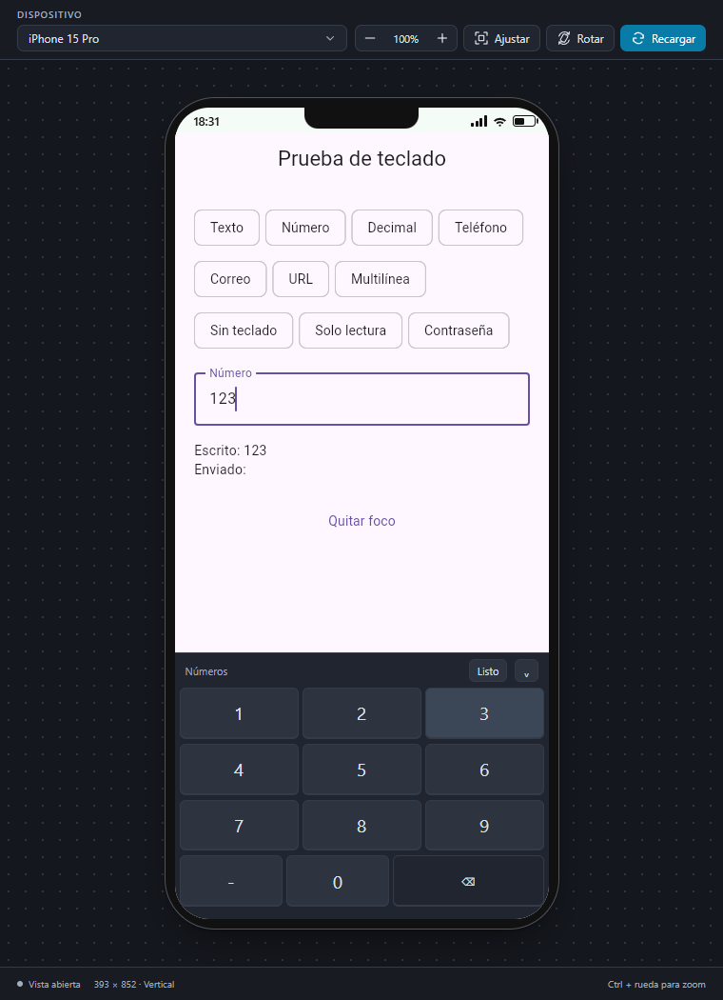

# Flutter Phone Preview

Preview your Flutter app inside VS Code with an iPhone, Android phone, or tablet frame. Switch devices, rotate the screen, adjust the zoom, and test text fields without leaving the editor.

## Screenshots

### Preview





### Virtual keyboard





## Start the preview

1. Open your Flutter project folder in VS Code.
2. Press **Ctrl + Shift + P** (or **Cmd + Shift + P** on macOS).
3. Search for and select **Flutter: Start Phone Preview**.
4. Wait for Flutter to compile your app. The first build may take a little longer.
5. The preview opens in a side panel with your app inside the selected device frame.

## Requirements

- The **Flutter Phone Preview** extension must be installed.
- Flutter must be installed and the `flutter` command must be available in your terminal.
- Open a Flutter project that supports the web.

The preview runs the web version of your app. It does not replace testing on a physical device or emulator.

## Preview controls

- **Device:** choose an iPhone, Android phone, or iPad from the selector.
- **Zoom:** zoom in, zoom out, or reset the preview size.
- **Rotate:** switch between portrait and landscape orientation.
- **Fit:** fit the device to the available panel space.
- **Reload:** reload the app in the preview.

## Virtual keyboard

Click a text field inside the device frame to open the virtual keyboard automatically. The keyboard adapts to the Flutter `TextInputType` used by the field.

- **Text:** letters, uppercase characters, spaces, and symbols.
- **Numbers and decimals:** numeric keys and decimal separators.
- **Phone:** numbers plus `+`, `*`, and `#`.
- **Email and URL:** quick access to `@`, `.`, and `/`.
- **Multiline:** supports line breaks.

Use **Backspace** to delete characters and **Done**, **Search**, or **Send** for the field action. Use the down arrow to hide the keyboard. The app has less vertical space while the keyboard is open.

Read-only fields and fields configured with `TextInputType.none` do not open the virtual keyboard. Some less common Flutter input types may use the text layout because Flutter Web does not expose a distinct browser input mode for them.

## REST APIs in the preview

REST support is enabled by default. Use your API's usual **absolute HTTP or HTTPS URL** in Flutter, for example `http://localhost:8080/api/products` or `https://api.example.com/products`. Requests from browser `fetch` and `XMLHttpRequest` clients, including the standard web clients used by `http` and Dio, pass through the extension's local proxy. Your Flutter source does not need to change.

The proxy supports HTTP methods such as GET, POST, PUT, PATCH, DELETE, HEAD, and OPTIONS; JSON, multipart uploads, binary responses, and explicit authentication headers such as `Authorization: Bearer ...`. It preserves the API's status codes, including errors such as 401 or 422. The API does not need CORS headers for these preview requests.

- The API must be reachable from the machine running the extension. For a local backend, use its actual localhost port; Android emulator addresses such as `10.0.2.2` do not refer to your computer in this web preview.
- HTTPS certificates are validated normally. An unavailable backend or invalid certificate returns a proxy error (502); a request exceeding 120 seconds returns 504.
- The proxy does not forward browser cookies or store API cookies. Use explicit authentication headers, or disable the proxy to test browser cookie authentication with your backend's CORS configuration.
- Relative URLs still refer to the Flutter web server. Requests made inside Web Workers and API WebSockets are not intercepted.
- Redirects are followed up to 10 times, and Authorization is removed when the destination origin changes. Uploads larger than 8 MiB are supported, but cannot be replayed if a redirect requires sending the same body again.
- This setting applies to development previews. Test your deployed Flutter Web app with the backend's actual CORS configuration.

To use the browser's normal networking behavior, disable **Flutter Phone Preview: Enable Rest Proxy** in Settings:

```json
{
  "flutterPhonePreview.enableRestProxy": false
}
```

Stop and start the preview after changing this setting.


## Update the app while working

By default, saving a `.dart` file requests a Flutter update and reloads the preview when recompilation finishes.

You can also open the Command Palette with **Ctrl + Shift + P** and run:

- **Flutter: Hot reload (phone preview)** to update the app.
- **Flutter: Hot restart (phone preview)** to restart the app state completely.

The update may reset the app state in the web preview.

## Stop the preview

Press **Ctrl + Shift + P** and select **Flutter: Stop Phone Preview**. This stops Flutter and closes the panel.

## Settings

Open VS Code Settings and search for **Flutter Phone Preview**. You can change:

- **Port:** the port used to run the app. The default is `5001`.
- **Device:** the device shown when the preview opens.
- **Enable Rest Proxy:** allow REST calls through the local preview proxy (enabled by default).
- **Persist Preferences:** keep the app's `shared_preferences` values between preview restarts, stored per project (enabled by default).
- **Auto Reload On Save:** enable or disable reloads when `.dart` files are saved.

## Persistent preferences

The preview proxy listens on a random port on every start, so the browser
`localStorage` used by the `shared_preferences` package would look empty on
every restart. The extension mirrors those values and restores them before
your app boots, with no changes needed in your Flutter code. Use
**Flutter: Clear Saved Preview Preferences** from the command palette to wipe
them and start clean.

## If the app does not appear

- Wait for the first Flutter build to finish.
- Open **View > Output** and select **Flutter Phone Preview** to see progress and errors.
- Check that your project can run on the web.
- If compilation has finished but the screen is blank, click **Reload** in the panel.
- If the port is busy, change **Port** in Settings and start the preview again.

## Continue improving

Flutter Phone Preview is under active development. More devices, preview controls, and Flutter Web improvements will be added over time.
